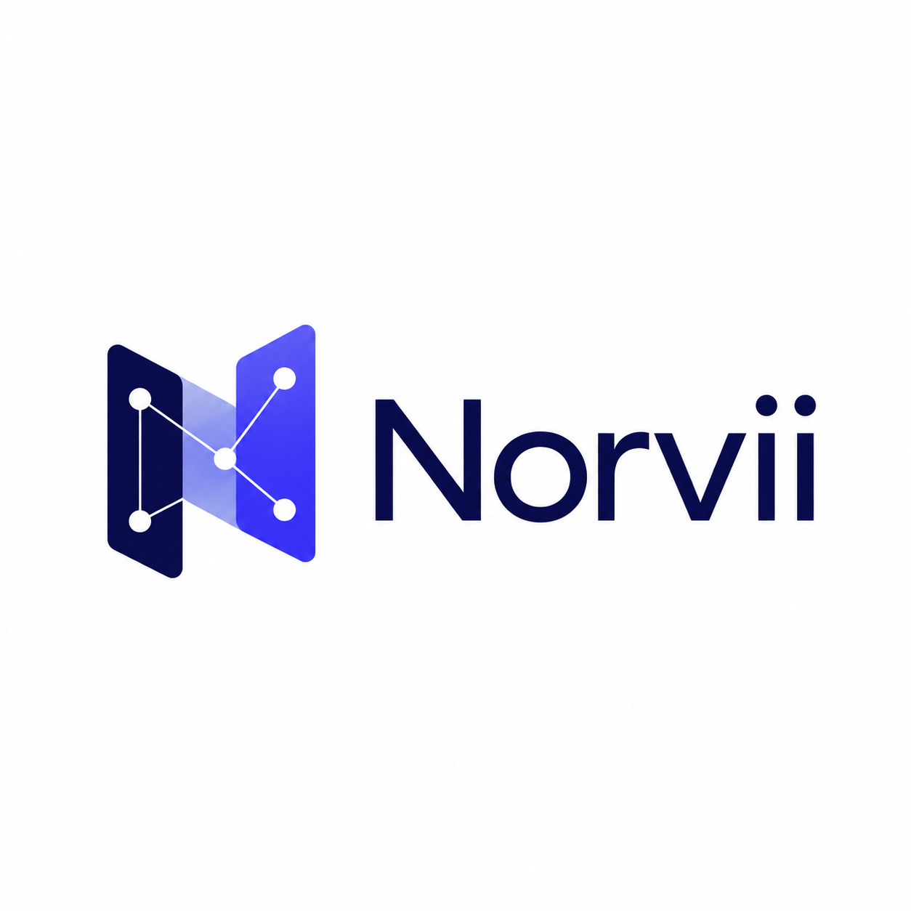

<p align="center">
  
</p>

# Norvii

[](https://github.com/dharlanoliveira/norvii/actions/workflows/ci.yml)
[](https://sonarcloud.io/dashboard?id=dharlanoliveira_norvii-web)
[](https://sonarcloud.io/dashboard?id=dharlanoliveira_norvii-api)
[](https://sonarcloud.io/dashboard?id=dharlanoliveira_norvii-ingestion)

Norvii is a proof of concept for evidence-grounded legal research using RAG,
GraphRAG, LLMs, MCP, and reusable skills. The application will let a user select a
small Portuguese or English corpus, browse its sources, and ask questions in a chat
whose answers include traceable citations.

The project is a technical demonstration and does not provide legal advice.

## Project status

Feature 004 provides the authoritative corpus and document slice. Feature 005 now
adds the grounded-chat boundary: legal-aware retrieval chunks, a corpus-scoped Go
SSE facade, a Python LangGraph agent, an OpenAI-compatible model adapter, and a
bilingual React composer with citation references. Configure `NORVII_CHAT_BASE_URL`
to enable model answers; without it the agent fails closed and the catalog/document
viewer remain usable.
Embedding enrichment and citation navigation continue in the remaining Feature 005
tasks.

PostgreSQL with pgvector is the canonical store. Standalone Neo4j Community remains
a rebuildable graph projection for later GraphRAG features and is not written by
Feature 004.

## Bootstrap the complete local environment

After creating `infra/.env` from the provided example and replacing both password
markers, start and verify all currently executable local components with:

```bash
make bootstrap
```

Codex users can invoke `$bootstrap-norvii` for the same managed workflow. Runtime
output is retained by component under `.log/`: `bootstrap.log`, `web.log`,
`api.log`, `agent.log`, `ingestion.log`, `postgres.log`, and `neo4j.log`. Repeated execution
reuses healthy processes rather than starting duplicates. Readiness is reported only
after both stable initial sources reach `ready` or an explicit retryable `failed`
state within the configured bound.

Inspect or stop the managed environment with `make local-status` and
`make local-stop`. Stopping retains both database volumes.

## Run an individual module

Prerequisites: Node.js 24 and npm.

```bash
npm --prefix apps/web ci
npm --prefix apps/web run dev
```

The web development server expects the API on `127.0.0.1:8080`; use `make bootstrap`
for the complete environment. Validate the web module with:

```bash
npm --prefix apps/web exec playwright install chromium
make -C apps/web ci
```

See the [web](apps/web/README.md), [API](apps/api/README.md), [agent](apps/agent/README.md),
and [ingestion](apps/ingestion/README.md) module guides for focused development.

## Run the persistence foundation

Prerequisites: Docker Compose, Go 1.26, Python 3.13, uv, Make, and Bash.

```bash
cp infra/.env.example infra/.env
# Replace both password markers in infra/.env.
make persistence
```

See the [local environment guide](docs/operations/local-environment.md) for health,
troubleshooting, isolated integration, non-destructive stop, and guarded reset
commands.

## Code quality analysis

GitHub Actions analyzes the production web, API, and ingestion modules as separate SonarQube Cloud projects within the Norvii monorepo. The Python agent has its own module CI gate and is not yet a Sonar project. Each same-repository pull request and push to `main` waits for all three Sonar quality gates, then applies the stricter Norvii policy that fails the build when any analyzed module has an unresolved Sonar issue.

| Module | Quality gate | Coverage |
| --- | --- | --- |
| Web | [](https://sonarcloud.io/project/overview?id=dharlanoliveira_norvii-web) | [](https://sonarcloud.io/project/overview?id=dharlanoliveira_norvii-web) |
| API | [](https://sonarcloud.io/project/overview?id=dharlanoliveira_norvii-api) | [](https://sonarcloud.io/project/overview?id=dharlanoliveira_norvii-api) |
| Ingestion | [](https://sonarcloud.io/project/overview?id=dharlanoliveira_norvii-ingestion) | [](https://sonarcloud.io/project/overview?id=dharlanoliveira_norvii-ingestion) |

View the SonarQube Cloud dashboards for [norvii-web](https://sonarcloud.io/project/overview?id=dharlanoliveira_norvii-web), [norvii-api](https://sonarcloud.io/project/overview?id=dharlanoliveira_norvii-api), and [norvii-ingestion](https://sonarcloud.io/project/overview?id=dharlanoliveira_norvii-ingestion). See [continuous integration](docs/development/continuous-integration.md#sonarqube-cloud-free-setup) for the monorepo configuration and gate behavior.

## Documentation map

- [Product overview](docs/product/overview.md): vision, scope, product behavior, and MVP boundary.
- [Legal corpora](docs/product/corpora.md): source model and proposed Portuguese and English collections.
- [Documentation guide](docs/README.md): ownership and location of every document
  type.
- [Feature map](docs/product/feature-map.md): proposed delivery sequence.
- [Spec-driven workflow](docs/development/spec-driven-development.md): how Codex and
  contributors move from capability to verified code.
- [Development tooling](docs/development/tooling.md): pinned Spec Kit version, project preset, workflow overlay, and upgrade rules.
- [Continuous integration](docs/development/continuous-integration.md): GitHub Actions builds and SonarQube Cloud gates.
- [Local environment](docs/operations/local-environment.md): full application bootstrap, logs, health, persistence, and guarded reset commands.
- [Executable prototyping](docs/development/prototyping.md): how React prototypes are built, reviewed, and approved before production.
- [Prototype workspace](prototypes/README.md): executable product experiments kept separate from production applications.
- [Production web client](apps/web/README.md): local startup, validation commands, and current client boundaries.
- [Repository structure](docs/architecture/repository-structure.md): target monorepo
  boundaries.
- [Module models](docs/modules/README.md): client, Go facade, Python agent, and ingestion
  responsibilities.
- [Constitution](.specify/memory/constitution.md): non-negotiable engineering and
  product rules.
- [Feature specifications](specs/README.md): numbered Spec Kit workspaces.

## Spec Kit workflow

For each capability, use the repository-local Spec Kit skills in this order:

1. `speckit-specify`
2. `speckit-clarify` when material ambiguity remains
3. `speckit-checklist`
4. `speckit-plan`
5. `speckit-tasks`
6. `speckit-analyze`
7. implementation approval gate
8. `speckit-implement`
9. `speckit-converge`

Do not start application code from the roadmap alone. Create or select the numbered
feature that owns the behavior first.

## License

Copyright (c) 2026 Dharlan Oliveira. Norvii is proprietary and available for personal evaluation and portfolio review only. See [LICENSE](LICENSE) for the full terms and [third-party notices](THIRD_PARTY_NOTICES.md) for separately licensed components.
