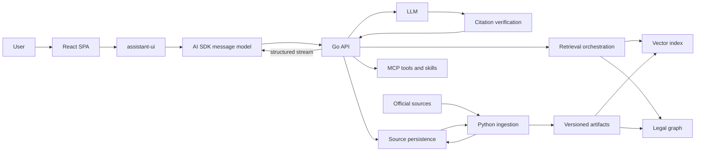

# System Architecture

## Overview

Norvii has three application modules: a React client, an online Go API, and an offline Python ingestion service. They communicate through versioned contracts and share only selected backing services.

These are production modules under `apps/`. The product experience is validated first in the isolated React prototype under `prototypes/web/`; production modules never depend on it.

Detailed ownership lives in the module models:

- [Web client](../modules/web-client.md)
- [Go API](../modules/go-api.md)
- [Python ingestion](../modules/python-ingestion.md)

The [repository structure](repository-structure.md) defines source roots and dependency direction. The [contract registry](../../contracts/README.md) defines how data crosses language boundaries.

## Ingestion flow

The Python pipeline runs outside the chat request path.

1. Claim a `pending` source and mark it `processing`.
2. Read the stored binary for a PDF or safely capture content for a URL.
3. Record official metadata, hash, and capture date.
4. Extract text while preserving legal structure.
5. Normalize headings, notes, articles, and references.
6. Split text along legal units instead of fixed size alone.
7. Generate embeddings when vector retrieval is enabled.
8. Extract graph entities and relations when GraphRAG is enabled.
9. Validate counts, references, and representative text samples.
10. Atomically publish artifacts and mark the source `ready`, or record a classified error and mark it `failed`.

The dispatch mechanism remains an [open decision](../decisions/backlog.md).

## Retrieval strategies

### Vector RAG

- Search semantically across chunks.
- Filter by corpus and optionally by language, document, and type.
- Rerank only when evaluation justifies the added dependency and cost.
- Limit answer context to the strongest evidence.

### GraphRAG

- Identify question entities.
- Traverse relations between provisions, concepts, actors, and obligations.
- Retrieve source passages attached to the relevant graph path.
- Synthesize from the evidence-backed subgraph.

### Hybrid retrieval

- Use vector search to locate initial evidence.
- Expand through the graph for references, exceptions, and related documents.
- Rank combined evidence before constructing model context.

## Initial legal graph

Start with the smallest schema justified by evaluation questions.

Node candidates:

- `Corpus`, `Document`, `Article`, `Section`, and `Recital`;
- `LegalConcept`, `Actor`, `Right`, `Obligation`, `Authority`, `Sanction`, and `Deadline`.

Relation candidates:

- `CONTAINS`, `DEFINES`, `REFERS_TO`, `AMENDS`, and `REGULATED_BY`;
- `GRANTS_RIGHT_TO`, `IMPOSES_OBLIGATION_ON`, `EXCEPTION_TO`, `ENFORCED_BY`, `HAS_DEADLINE`, and `INTERPRETS`.

Add a node or relation type only when an evaluation question requires it.

## Durable architecture decisions

- [Three application modules](../decisions/0001-three-module-architecture.md)
- [Corpus and source model](../decisions/0002-corpus-and-source-model.md)
- [Spec-driven delivery](../decisions/0003-spec-driven-delivery.md)
- [Executable React prototype](../decisions/0004-executable-react-prototype.md)

Technology selections that remain unresolved are tracked in the [decision backlog](../decisions/backlog.md).
