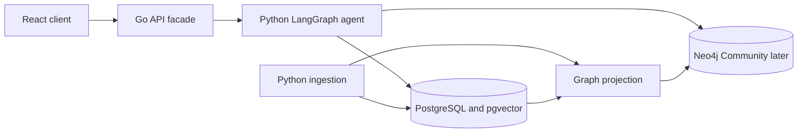

# ADR 0005: PostgreSQL and Neo4j Persistence

- Status: Accepted
- Date: 2026-08-13
- Feature: local project foundation and later retrieval features
- Deciders: project maintainers

## Context

Norvii must persist corpus and source state, PDF binaries, external URLs, complete normalized documents, hierarchical document parts, retrieval fragments, embeddings, and LLM-extracted knowledge. The extracted knowledge includes entities, relationships, factual assertions, allegations, legal rules, and timeline events. Every derived item must remain traceable to exact source evidence and reproducible across ingestion versions.

Vector similarity alone cannot represent document hierarchy, provenance, temporal ordering, or multi-hop relationships. A graph database alone is not the preferred system of record for source lifecycle, binary storage, versioned ingestion releases, and transactional application data. The POC needs both capabilities without introducing clustered infrastructure.

## Decision drivers

- Preserve one transactional and versioned source of truth.
- Store PDF binaries in the database at the deliberately small POC scale.
- Enforce corpus isolation before vector or graph retrieval.
- Support semantic search in Portuguese and English.
- Represent complete documents and their hierarchical legal units without duplication.
- Preserve evidence and extraction provenance for every LLM-derived assertion.
- Demonstrate GraphRAG traversal and visualization with low local operational complexity.
- Allow graph projections to be rebuilt after schema or extraction changes.
- Use maintained Go and Python database drivers.

## Options considered

### PostgreSQL with pgvector only

This option provides relational persistence, binary storage, versioning, metadata filters, embeddings, and recursive SQL traversal in one service. It has the lowest operational cost, but it weakens the GraphRAG demonstration and makes evolving graph traversal less expressive.

### PostgreSQL with pgvector and Neo4j Community

PostgreSQL remains canonical while a standalone Neo4j Community instance contains a rebuildable graph projection. This adds one local service and projection consistency work, but gives each persistence model a clear responsibility and provides a first-class GraphRAG query surface.

### Neo4j as the only database

This option reduces the service count and supports graph and vector queries. It makes transactional source management, PDF binary storage, ingestion publication, and relational reporting depend on a graph representation and turns the rebuildable index into the source of truth.

### PostgreSQL with Apache AGE

This option keeps graph and relational data in one server. It increases dependence on a PostgreSQL extension with a narrower compatibility matrix and does not provide the same isolated, demonstrable graph database surface as Neo4j.

## Decision

Use PostgreSQL with the pgvector extension as Norvii's canonical persistence service. Use one standalone Neo4j Community instance as a derived GraphRAG projection. The default local Docker Compose environment will start both services; clustering, replication, and Neo4j Enterprise features are outside the POC scope.

The React client accesses neither database directly. The Go API owns the public online
application boundary, while the Python LangGraph agent owns online retrieval access.
Python ingestion reads source work, publishes versioned canonical artifacts to PostgreSQL
through explicit contracts, and updates or triggers the Neo4j projection through an
idempotent publication boundary.

### Canonical records

PostgreSQL stores:

- corpora, sources, lifecycle state, and ingestion runs;
- PDF binaries as `bytea` values logically separated from frequently queried source metadata;
- external URLs, capture metadata, and content hashes;
- immutable source revisions and document versions;
- complete normalized document text;
- hierarchical document units such as titles, chapters, sections, articles, paragraphs, items, and pages;
- retrieval fragments and their embeddings;
- versioned semantic nodes, edges, statements, events, and evidence spans;
- publication state and graph projection checkpoints.

A document version is the complete normalized representation of one source revision. A document unit belongs to that version and may reference a parent unit, an ordinal position, page range, character offsets, an official marker, and a stable locator. Articles and sections are parts of the complete document, not independent source documents.

### LLM-derived knowledge

LLM extraction output is stored separately from official source metadata and is tied to an immutable extraction run. Facts and allegations are modeled as attributed statements rather than unquestioned truth. Statements and timeline events record their classification, model and prompt version, confidence when available, review state, and one or more evidence spans that resolve to document units and exact source locations.

The initial semantic categories include entities, relationships, factual assertions, allegations, legal rules, definitions, obligations, rights, and timeline events. A later ingestion specification will define the versioned contract and may narrow this list according to evaluation questions.

### Embeddings

pgvector stores embeddings for typed retrieval fragments. Candidate fragment types include chunks, complete legal units, document summaries, semantic statements, events, and later graph-community summaries. Each embedding records the model, dimensions, input hash, artifact version, language, and owning corpus.

The embedding model, dimensions, distance metric, approximate-index strategy, and reranking policy remain open. The initial implementation must prefer the smallest strategy that satisfies measured POC retrieval needs and must enforce corpus filtering in every query.

### Graph projection

Neo4j stores projected nodes and relationships with canonical PostgreSQL identifiers and artifact-release identifiers. PostgreSQL remains authoritative when the stores disagree. The projection must be idempotent and fully reconstructible from one published artifact release. Deleting the Neo4j data volume must not destroy canonical source or extraction data.

Publication must not require a distributed transaction. A later feature will select an outbox, polling, or explicit-command mechanism and define when a graph release becomes queryable.

## Consequences

### Positive

- Source state, binaries, document structure, embeddings, and extraction provenance share one canonical transactional boundary.
- Neo4j provides expressive graph traversal and portfolio-visible GraphRAG behavior without owning irreplaceable data.
- The graph can be regenerated after ontology, prompt, or extraction changes.
- PostgreSQL metadata filters can enforce the active corpus before retrieval results reach the application.
- The local environment remains a two-database, single-node POC rather than a distributed cluster.

### Negative

- Local development requires PostgreSQL and Neo4j.
- The project must define and test a projection contract between canonical artifacts and Neo4j.
- Graph projection is eventually consistent with PostgreSQL.
- Backup, health checks, migrations, and resource limits must cover both services.
- The schema must distinguish official metadata, normalized text, generated statements, and graph projections to prevent provenance ambiguity.

## Verification

The local foundation feature must pin both container images, provide health checks and named volumes, run PostgreSQL migrations, verify pgvector, and prove Go and Python connectivity. Ingestion tests must show that a complete document and its hierarchy are published atomically, every semantic artifact resolves to evidence, and reprocessing does not create duplicate active artifacts. Projection tests must rebuild Neo4j from PostgreSQL, remain idempotent, preserve corpus boundaries, and detect an incompatible artifact release.

Reconsider this decision if POC measurements show that the second database adds more operational cost than GraphRAG demonstration value, PostgreSQL cannot satisfy binary or vector requirements at the measured corpus size, or Neo4j Community lacks a required traversal capability.

## References

- [Corpus and source model](0002-corpus-and-source-model.md)
- [System architecture](../architecture/overview.md)
- [Legal corpora](../product/corpora.md)
- [Local environment](../operations/local-environment.md)
- [PostgreSQL TOAST storage](https://www.postgresql.org/docs/current/storage-toast.html)
- [pgvector](https://github.com/pgvector/pgvector)
- [Microsoft GraphRAG indexing](https://microsoft.github.io/graphrag/index/overview/)
- [Neo4j vector indexes](https://neo4j.com/docs/cypher-manual/current/indexes/semantic-indexes/vector-indexes/)
