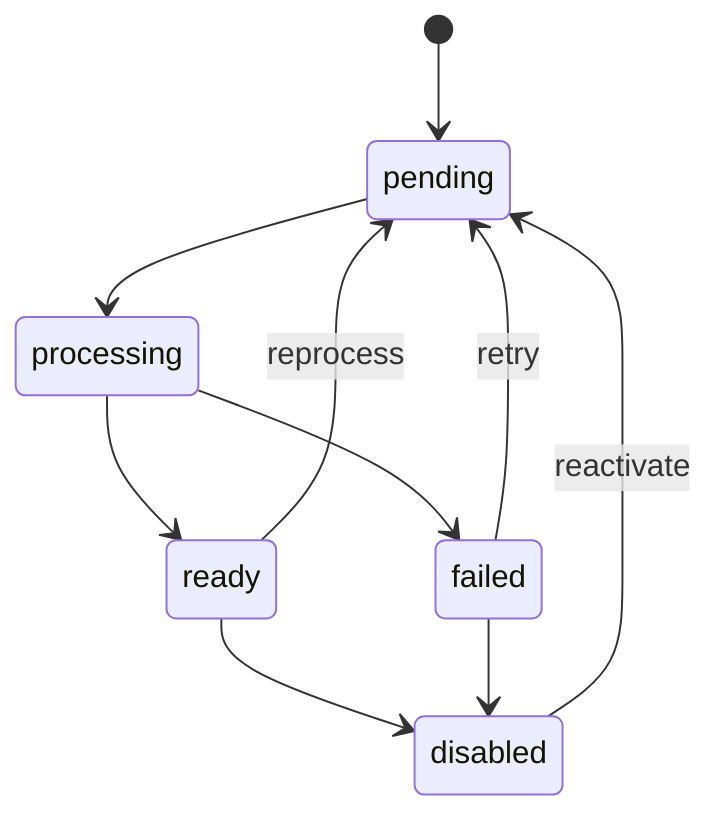

# Legal Corpora

## Domain model

A `Corpus` is an isolated searchable collection whose sources share a language, jurisdiction, and research context. Every query identifies one active corpus.

Initial corpus fields:

- stable internal identifier;
- name and description;
- language and jurisdiction;
- lifecycle status;
- creation and update timestamps.

A `Source` belongs to exactly one corpus and has one of two source types.

| Type | Persisted origin | Type-specific metadata |
| --- | --- | --- |
| `PDF` | File binary in the database | Original name, MIME type, size, and hash |
| `URL` | External link in the database | URL, capture date, and extracted-content hash |

Common source fields include a stable identifier, corpus identifier, title, processing status, latest error message, and creation, update, and processing timestamps.

Derived documents, legal units, retrieval fragments, embeddings, and semantic extractions are versioned ingestion artifacts associated with a source revision. They are not part of the original source record. A URL source keeps its link as origin and also records extracted text, capture date, and hash so citations remain reproducible. Persisting the raw downloaded web page is outside the initial scope.

## Document structure and provenance

Each successfully processed source revision produces an immutable document version. The version stores the complete normalized document and links it to a hierarchy of addressable units such as title, chapter, section, article, paragraph, item, recital, or page.

Each unit records its parent, order, visible marker, page range when available, text offsets, content hash, and stable source locator. Retrieval fragments and citations resolve back to these units and their evidence spans instead of duplicating document structure.

Official metadata remains separate from knowledge inferred by a model. Every extraction run records its pipeline, model, prompt, and artifact versions. Extracted artifacts may include entities, relationships, factual assertions, allegations, legal rules, definitions, rights, obligations, and timeline events. Each artifact retains its source revision and supporting evidence spans.

An extracted fact is an attributed assertion until a review or an authoritative source establishes a stronger status. Confidence scores express model certainty; they do not establish legal authority or truth.

PostgreSQL with pgvector is the canonical store for these records. Neo4j receives a rebuildable graph projection linked by canonical identifiers. The persistence boundary is defined in [ADR 0005](../decisions/0005-postgresql-and-neo4j-persistence.md).

## Source lifecycle

Only `ready` sources participate in retrieval. Chat reports when an active corpus has no ready source.

## Initial legal corpora

Norvii's initial evaluation scope contains three independent legal corpora. They are separate
retrieval roots, not labels or folders under an information-security corpus. A source, snapshot,
dataset revision, evaluation result, or opening suggestion belongs to one corpus only.

| Corpus | Stable identifier | Jurisdiction | Dataset asset directory |
| --- | --- | --- | --- |
| Brazilian Personal Data Protection (LGPD) | `brazil-personal-data-protection` | Brazil, federal | `data/corpora/brazil-lgpd/evaluation/` |
| Brazilian Anti-Corruption and White-Collar Crime | `brazil-anti-corruption-white-collar-crime` | Brazil, federal | `data/corpora/brazil-anti-corruption/evaluation/` |
| United States Fair Housing and Disability Accommodations | `us-fair-housing-disability-accommodations` | United States, federal | `data/corpora/us-fair-housing-disability-accommodations/evaluation/` |

The project-owned dataset manifests define the authoritative official-source set for each corpus.
They are evaluation inputs, not permission to acquire, change, or automatically publish a source.
Source acquisition and processing remain subject to the normal controlled ingestion process.

## Source readiness and snapshots

A corpus is eligible for a versioned evaluation dataset or opening suggestions only when all of
the following are true:

1. Its intended source revisions are processed and represented by an immutable published snapshot.
2. Each manifest source is explicitly bound to a source in the same corpus and is a member of that
   snapshot.
3. Every required legal locator resolves uniquely to the snapshot's versioned document unit or
   evidence span.
4. The compatible dataset revision has completed review and is available for publication.

An absent source, unresolved locator, draft dataset, disabled release, changed manifest, or later
active snapshot makes the dependent evaluation or suggestion projection unavailable. The system
must not substitute another source, corpus, snapshot, or approximate legal location.

## Corpus opening suggestions

An empty chat can show a small discovery list only from a separately published,
corpus-and-snapshot-bound projection of a reviewed available dataset revision. The projection
contains rank, stable case ID, checksum, language, and the original question text. It excludes
reference answers, expected evidence, review notes, evaluation outcomes, and execution details.

For a published compatible projection, the workspace selects the exact reciprocal case matching
the interface language and preserves rank order. It does not translate, synthesize, randomize, or
fall back to questions from LGPD or another corpus. If the selected corpus has no compatible active
projection, the empty chat shows no suggestion list.

## Required legal metadata

Record these fields when the official source provides them:

- stable internal identifier;
- official title;
- language and jurisdiction;
- issuing authority;
- legal document type;
- official URL;
- publication and effective dates;
- capture date;
- hash of the original PDF or captured URL content;
- license or reuse rule;
- document status;
- relation to amendments and related documents.

## Corpus readiness checklist

- [ ] Confirm one of the three named corpus identities and its official source set.
- [ ] Acquire documents only from official sources and verify reuse rules for every source.
- [ ] Keep original and normalized representations separate.
- [ ] Record source origin, capture date, hash, authority metadata, and document status.
- [ ] Create and publish an immutable snapshot with its versioned manifest.
- [ ] Bind every dataset manifest source to that corpus and resolve each required legal locator.
- [ ] Review and mark the compatible dataset revision available before publishing any evaluation
      run or opening-suggestion projection.
- [ ] Treat all chat output and evaluation measurements as technical information, not legal advice
      or a legal conclusion about a real person or entity.
