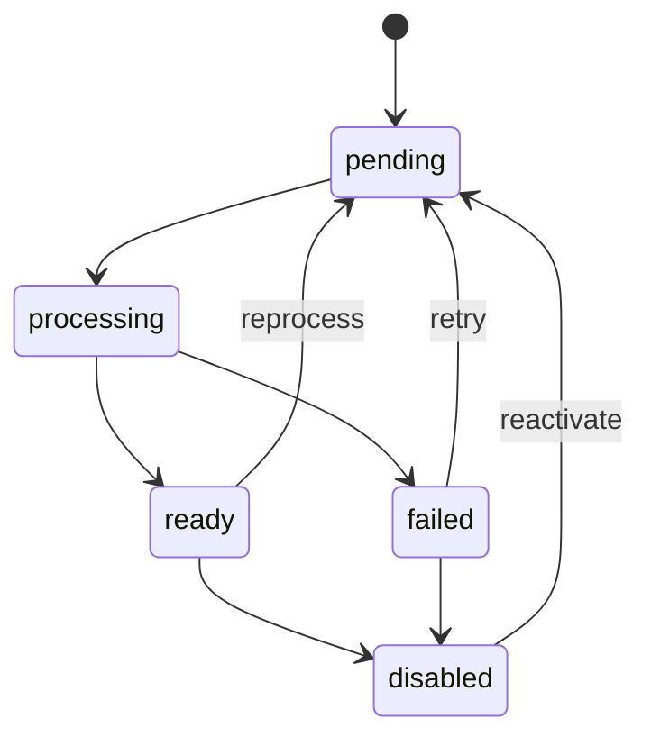

# Legal Corpora

## Domain model

A `Corpus` is an isolated searchable collection whose sources share a language, jurisdiction, and research context. Every query identifies one active corpus.

Initial corpus fields:

- stable internal identifier;
- name and description;
- language and jurisdiction;
- lifecycle status;
- creation and update timestamps.

A `Source` belongs to exactly one corpus and has one of two source types.

| Type | Persisted origin | Type-specific metadata |
| --- | --- | --- |
| `PDF` | File binary in the database | Original name, MIME type, size, and hash |
| `URL` | External link in the database | URL, capture date, and extracted-content hash |

Common source fields include a stable identifier, corpus identifier, title, processing status, latest error message, and creation, update, and processing timestamps.

Derived text, legal units, chunks, embeddings, and graph relations are ingestion artifacts associated with a source. They are not part of the original source record. A URL source keeps its link as origin and also records extracted text, capture date, and hash so citations remain reproducible. Persisting the raw downloaded web page is outside the initial scope.

## Source lifecycle

Only `ready` sources participate in retrieval. Chat reports when an active corpus has no ready source.

## Recommended legal domain

The proposed initial domain is data protection. The two corpora cover related concepts in different languages and jurisdictions, which supports comparable demonstrations without requiring a large collection.

This proposal remains subject to confirmation before corpus acquisition begins.

## Portuguese corpus

Jurisdiction: Brazil. Language: Portuguese.

Proposed sources:

1. [Lei Geral de Protecao de Dados Pessoais, Lei 13.709/2018](https://www.planalto.gov.br/ccivil_03/_ato2015-2018/2018/lei/l13709.htm)
2. [Resolucao CD/ANPD 2/2022, agentes de tratamento de pequeno porte](https://www.gov.br/anpd/pt-br/acesso-a-informacao/institucional/atos-normativos/regulamentacoes_anpd/resolucao-cd-anpd-no-2-de-27-de-janeiro-de-2022)
3. Resolucao CD/ANPD 15/2024, comunicacao de incidente de seguranca
4. Resolucao CD/ANPD 18/2024, atuacao do encarregado

Use the [official ANPD regulation index](https://www.gov.br/anpd/pt-br/acesso-a-informacao/institucional/atos-normativos/regulamentacoes_anpd) to locate current official versions.

Preliminary estimate after extraction and cleanup: 40,000 to 70,000 tokens. The estimate must be replaced by a measured value after ingestion exists.

Optional expansion: Resolucao CD/ANPD 4/2023 on administrative sanction calculation and application.

## English corpus

Jurisdiction: European Union. Language: English.

Proposed sources:

1. [General Data Protection Regulation, Regulation EU 2016/679](https://eur-lex.europa.eu/eli/reg/2016/679/oj/eng/)
2. [EDPB Guidelines 07/2020 on controller and processor concepts](https://www.edpb.europa.eu/documents/guideline/guidelines-072020-on-the-concepts-of-controller-and-processor-in-the-gdpr_en)
3. [EDPB Guidelines 9/2022 on personal data breach notification](https://www.edpb.europa.eu/documents/guideline/guidelines-92022-on-personal-data-breach-notification-under-gdpr_en)

Preliminary estimate after extraction and cleanup: 100,000 to 150,000 tokens. The estimate must be replaced by a measured value after ingestion exists.

Optional expansion: EDPB Guidelines 01/2022 on the right of access.

## Required legal metadata

Record these fields when the official source provides them:

- stable internal identifier;
- official title;
- language and jurisdiction;
- issuing authority;
- legal document type;
- official URL;
- publication and effective dates;
- capture date;
- hash of the original PDF or captured URL content;
- license or reuse rule;
- document status;
- relation to amendments and related documents.

## Corpus readiness checklist

- [ ] Confirm the initial data-protection scope.
- [ ] Confirm the initial document set.
- [ ] Acquire documents only from official sources.
- [ ] Verify reuse rules for every source.
- [ ] Measure tokens after extraction.
- [ ] Keep original and normalized representations separate.
- [ ] Create a versioned manifest for each corpus.
- [ ] Define a snapshot date for reproducible evaluation.
